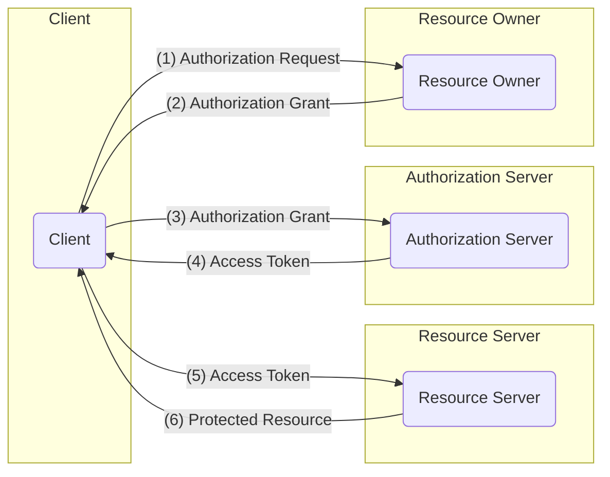
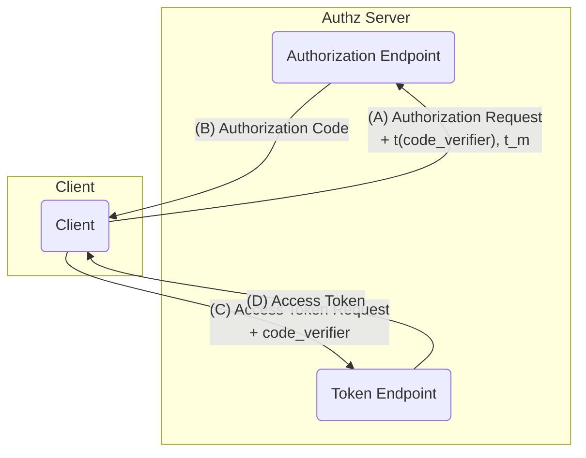

# Oauth

## Introduction

Oauth is a token based third party authentication protocol. Its little bit different than traditinal client server based authentication, where server has client authentication data stored and client gives that data to access the server. In Oauth model, the third party applications ask for certain resources on behalf of user without exposing user credentilas. Looking from user perspective, think of it as instead of remembering multiple passwords, you remember one user credential. This model makes the user sign in and sign up very easy. Lets look how it works. This authentication model is stateless so the client do not need to save the user sessions.

## How it works?

### Entities in Oauth 2.0

1. **Resource Owner**:
    - Owner of the resource
    - is capable of granting access to the resource.
    - When we try to login through google. then we are resource owner

2. **Resource Server**:
    - The server hosting the protected resources (e.g., Google's API endpoints for Photos, Calendar, Drive).
    - Capable of accepting and responding to protected resource requests using access tokens. It enforces access control based on the token's validity and associated permissions.
    
3. **Client**:
    - Entity making resource request on behalf of resource owner along with its auth keys. 
    - The application (e.g., a website, mobile app, desktop application) making protected resource requests on behalf of the Resource Owner.
    - It is identified by a `client_id` and may have a `client_secret` (for confidential clients).

4. **Authorization Server**:
    - Server issuing access tokens to client after authntication and authorization from Resource owner
    - Authorization Server and Resource Server can be same.

### Protocol Flow

1. **Authorization Request**
    Client asks for authorization from resource owner. It can be made directly or through **Authorization Server** as intermediary

2. **Authorization Grant**
    If authorization request is approved by Resource Owner, then a **Authorization Grant** credential is given to the client.

3. **Access Token Request**
    The Clint requests for Access Token using  **Authorization Grant** to the **Authorization Server**. 

4. **Access Token Issue**
    **Authorization Server** after checking the validity of the grant authenticated the client. If valid, then **Access Token** and **Referesh Token** is given to the client.

5. **Protected Resource Request**
    The **Client** uses the **Access Token** to get the resources it needs from **Resource Server**. I

6. **Protected Resource Response**
    The **Resource Server** validates the token, and serves the request if the token is valid

To get the **Authorization Grant** from Resource Owner, the **Authorization Server** is usually used as intermediary.

### Some important Considerations

1. **Scope**: 
    What kind of resources the client access on behalf of *Resource Owner* needs to be properly defined. In normal user flow, this information is  presented to the user in the consent screen, and the tokens issued to the application will be limited to the scopes granted. During Client registration with Authorization Server, the scope required by client is asked beforehand.

2. **Redirect URI**:
    During initial user consent phase, the *redirect uri* is given. After successfully authorizing the client application, the user should be redirected to the client page. This is also important in view of security, as this uri is sent along side the auth grant code. To make sure this auth grant code is given to intended client application, the *redirect uri* is matched with the predefined client *redirect uri*. If the *redirect uri* does not match with the initial client given uri, the authentication fails. 

3. **Tokens**:
    After successfull authentication, the usually two tokens are given, *Access Token* and *Refresh Token*. These JWT tokens have header which contains metadata about the token. The payload contains certain user info along with the expiry date of token. The Signature is created out of signing Header and Payload. Either HMAC algorithm can be used which uses single secret key or RSA can be used which uses public private key pair to generate signature. The Public keys are made available by Authorization Server.

    After getting the tokens, the client checks for the access token in every request header, it denies the request if its not present or is expired. The Refresh token which has a longer expiry time, can be used to get new version of tokens.

4. **Authorization grant**:
    After the Resource Owner approves the client request, the *Resource Server* provies the Authorization grant. Using this Authorization grant, the client can get the tokens from *Authorization Server*. 
    
    There are four types of Authorization grant
    * *Authorization Code*: 
        The auth code is attached with *redirect URI*, the client gets the auth code from *redirect uri* and sends the token request to *Authorization Server*. This gives the ability to also authenticate the client. This is most commonly used today.
    * *Implicit*: 
        The tokens are directly passed to the user itself. This is not recommended. 
    * *Resource Owner Password Credential*:
        Resource Owners Password is shared with the client directly. This is not considered a safe practice and is avoided.
    * *Client Credential*:
        When Client himself is resource owner then this approach is used. This is used for machine to machine authentication. Authentication between two services through APIs. *Refresh Token* is not included in this type.

5. **Proof Key for Code Exchange**:
    There is possiblity that someone intecepts the Auth Code, and uses that auth code to generate the tokens. To avoid the inteception of the Auth Code attack, this protocol is used.
    

1. The client creates and records a secret named the "code_verifier" and derives a transformed version "t(code_verifier)" (referred to as the `code_challenge`), which is sent in the OAuth 2.0 Authorization Request along with the transformation method `t_m`.

2. The Authorization Endpoint responds as usual but records `t(code_verifier)` and the transformation method.

3. The client then sends the authorization code in the Access Token Request as usual but includes the "code_verifier" secret generated at (A).

4. The authorization server transforms "code_verifier" and compares it to `t(code_verifier)` from (B).  Access is denied if they are not equal.

An attacker who intercepts the authorization code at (B) is unable to redeem it for an access token, as they are not in possession of the `code_verifier` secret.

## Resources

1. (RFC 6749: The OAuth 2.0 Authorization Framework)[https://datatracker.ietf.org/doc/html/rfc6749]

2. (RFC 7636: Proof Key for Code Exchange by OAuth Public Clients)[https://datatracker.ietf.org/doc/html/rfc7636]

