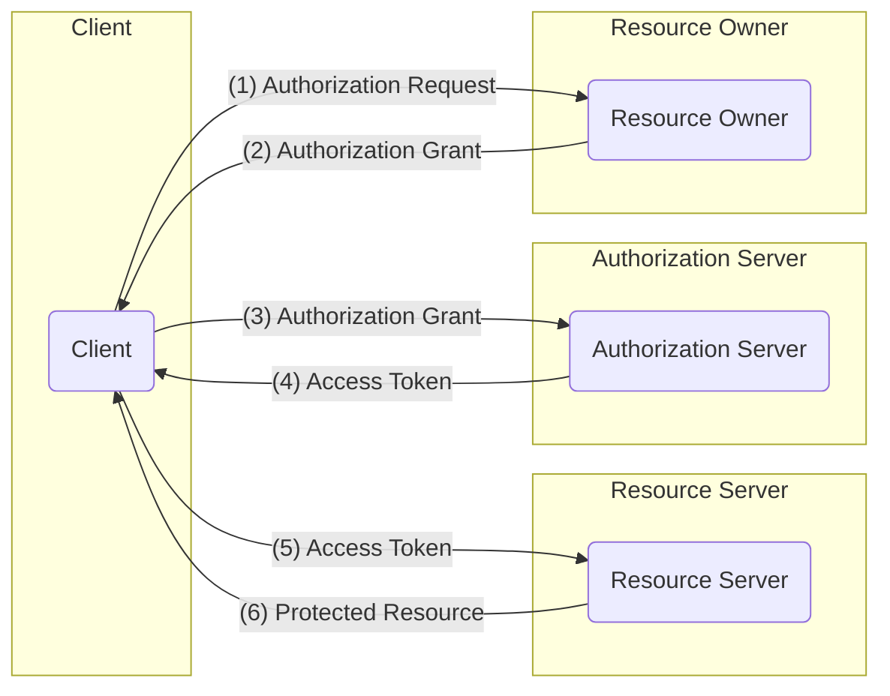

# OAuth 2.0

- Oauth is Token based authentication model. 
- Different than traditional Client server authentication model.

## Entities in Oauth 2.0

1. **Resource Owner**:
    - Owner of the resource
    - is capable of granting access to the resource.
    - When we try to login through google. then we are resource owner

2. **Resource Server**:
    - The server hosting the protected resources (e.g., Google's API endpoints for Photos, Calendar, Drive).
    - Capable of accepting and responding to protected resource requests using access tokens. It enforces access control based on the token's validity and associated permissions.
    
3. **Client**:
    - Entity making resource request on behalf of resource owner along with its auth keys. 
    - The application (e.g., a website, mobile app, desktop application) making protected resource requests on behalf of the Resource Owner.
    - It is identified by a `client_id` and may have a `client_secret` (for confidential clients).

4. **Authorization Server**:
    - Server issuing access tokens to client after authntication and authorization from Resource owner
    - Authorization Server and Resource Server can be same.

## Protocol Flow

1. **Authorization Request**
    Client asks for authorization from resource owner. It can be made directly or through **Authorization Server** as intermediary

2. **Authorization Grant**
    If authorization request is approved by Resource Owner, then a **Authorization Grant** credential is given to the client. There are four types of authorization grant

    - Authorization Code
    - Implicit
    - Resource Owner Password Credential
    - Client Credential

3. **Access Token Request**
    The Clint requests for Access Token using  **Authorization Grant** to the **Authorization Server**. 

4. **Access Token Issue**
    **Authorization Server** after checking the validity of the grant authenticated the client. If valid, then **Access Token** and **Referesh Token** is given to the client.

5. **Protected Resource Request**
    The **Client** uses the **Access Token** to get the resources it needs from **Resource Server**. I

6. **Protected Resource Response**
    The **Resource Server** validates the token, and serves the request if the token is valid

To get the **Authorization Grant** from Resource Owner, the **Authorization Server** is usually used as intermediary.

## Resources

1. (RFC 6749: The OAuth 2.0 Authorization Framework)[https://datatracker.ietf.org/doc/html/rfc6749]

## TODO Research:

- Read RFC 9700
- Read OpenID Connect
- Read RFC 6749
    
## Mention

- Scope
- Authorization Bearer
- Threat modelling

## Rough Notes

## Auth Grant type

1. Auth code
The client directs user(Resource Owner) to auth server to get auth code -- auth grant type, after getting auth code auth server redirects RO back to client. This is only for auth code grant type.

Auth code gives ability to also authenticate the client. passes tokens to the client directly instead of user. (This is still visible to user, but as auth code is short lived its not an issue. some auth servers will also ask client id, secret and scope and client secret will not be visible to user)

Auth code are intermediate creds using which you can get actual tokens

here scope is checked, client creds are (authnticated and authorized)checked and validated 

2. Implicit

No auth code bs. directly access/refresh token.good for frontend only system ie systems which run on browser (extentions). 
 
The authntication of client is not done
