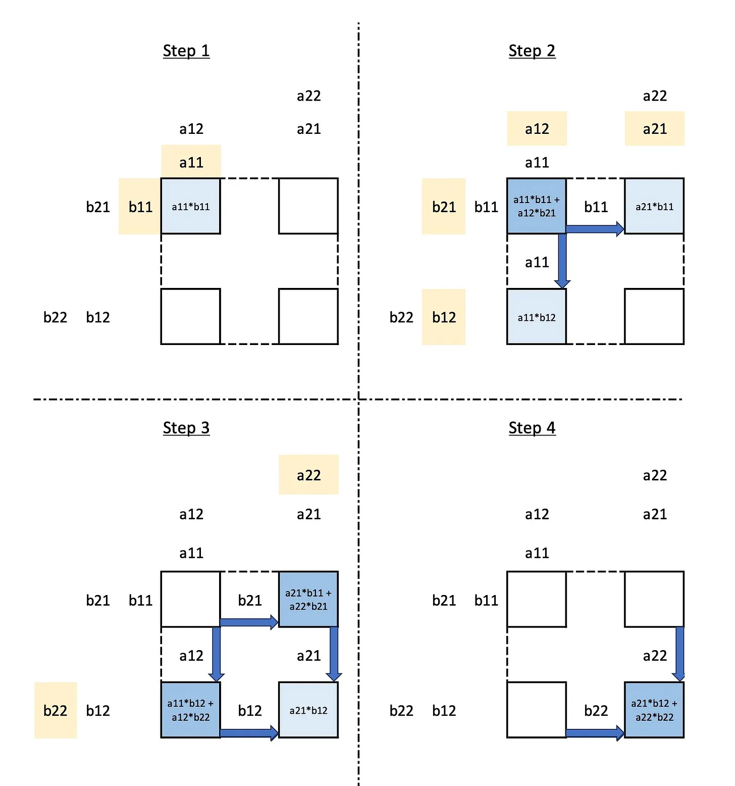

# Google TPU 

- Read about Google TPU's. Based on Systollic arrays. 
- Systollic Arrays is pretty much like a pipeline where like a human heart processing, inflow and out flow of data happens at he same time. 
- In a systollic arrays, the result goes and new input enters the array. Pretty much similar like how the Gstreamer Pipeline should operate. 
- This is good way to do vector arithematics.

**THERE IS GOING TOBE ALOT OF COPY PASTE IN THIS**

## Matrix multiplication in Systoliic way

Consider 2 matrices of dimention 2x2. To perform the matrix multiplication in systolic way it would as shown in figure below

It takes 4 steps to do 2x2 matrix multiplication. During starting and ending of the some of the MAC(Multiply/ Accumulate Unit) are not used.

If data is fed in correct order larger matrix multiplication opertation can also be done very efficiently if data is fed in right order to Systollic arrays

There is no need of 