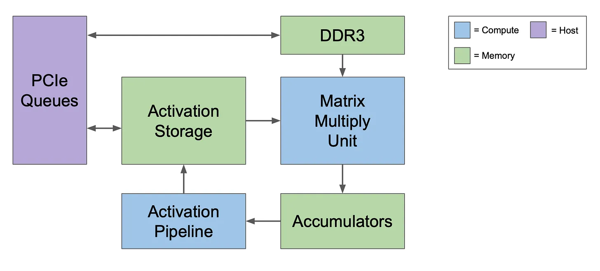
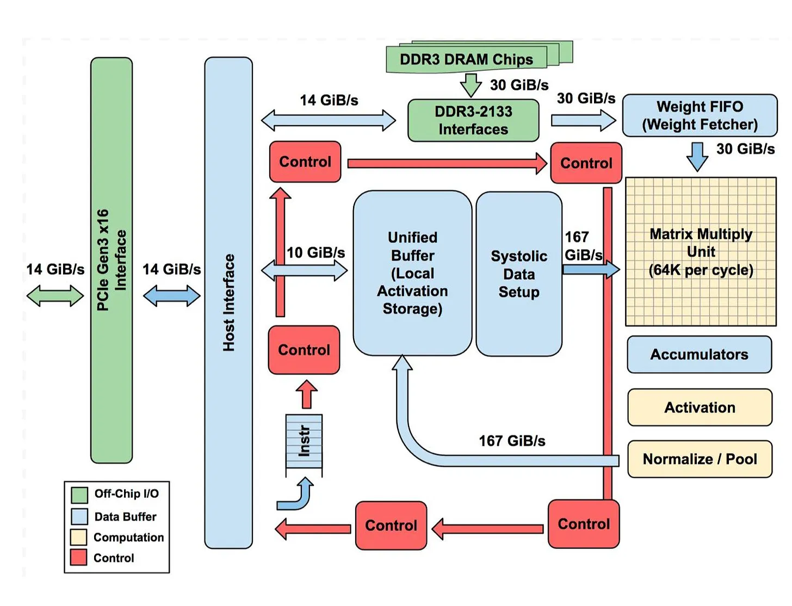
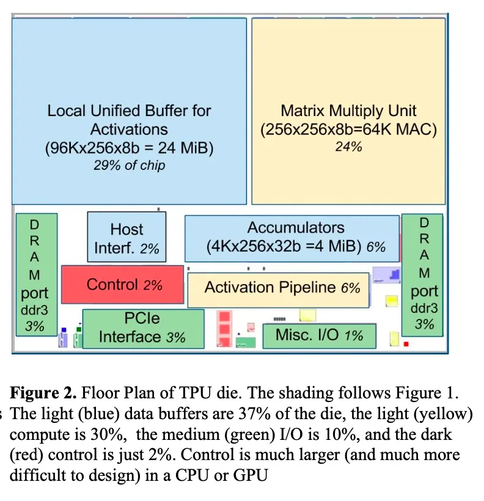
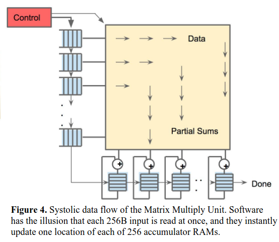

# Google TPU 

## TLDR / Notes to self:
- Systollic Arrays is pretty much like a pipeline where like a human heart processing, inflow and out flow of data happens at he same time. 
- In a systollic arrays, the result goes and new input enters the array. Pretty much similar like how the Gstreamer Pipeline should operate but doesnt. 
- This is good way to do vector arithematics.

## Matrix multiplication in Systoliic way

Consider 2 matrices of dimention 2x2. To perform the matrix multiplication in systolic way it would as shown in figure below

It takes 4 steps to do 2x2 matrix multiplication. During starting and ending of the some of the MAC(Multiply/ Accumulate Unit) are not used.

If data is fed in correct order larger matrix multiplication opertation can also be done very efficiently if data is fed in right order to Systollic arrays

Because of above process there is no need to store or load the data to the main memory area. Intermediate results are stored in MAC only. 

## TPU

Googles TPU are made to take advantage of this systollic array architecture. TPU (Tensor Proceesing Unit) is nothing but special ASIC( Application Specific Integrated Circuit). The perform calculations on tensors.

## TPUv1 Design

Initial V1 architecture was only used for inference of the neural networks. 

In V1 architecture PCIE bus was given for communication with main host computer. It also has direct acees to its own DDR3 dynamic ram storage

Rather than be tightly integrated with a CPU, to reduce the chances of delaying deployment, the TPU was designed to be a coprocessor on the PCIe I/O bus, allowing it to plug into existing servers just as a GPU does. Moreover, to simplify hardware design and debugging, the host server sends TPU instructions for it to execute rather than fetching them itself. TPUv1 are more like FPU(Floating Point unit) coprocessor than GPU

### Brief overview of each element

1. DDR3 DRAM / Weight FIFO: 
    > Weights are stored in DDR3 RAM chips connected to the TPU v1 via DDR3-2133 interfaces. Weights are ‘pre-loaded’ onto these chips from the host computer’s memory via PCIe and can then be transferred into the ‘Weight FIFO’ memory ready for use by the matrix multiply unit.
2. Matrix Multiply Unit:
    > This is a ‘systolic’ array with 256 x 256 matrix multiply/accumulate units that is fed by 256 ‘weight’ values from the top and 256 data inputs from the left.
3. Accumulators:
    > The results emerge from the systolic matrix unit at the bottom and are stored in ‘accumulator’ memory storage.
4. Activation:
    > The activation functions described in the neural network above are applied here.
5. Unified Buffer / Systolic Data Setup: 
    > The results of applying the activation functions are stored in a ‘unified buffer’ memory where they are ready to be fed back as inputs to the Matrix Multiply Unit to calculate the values needed for the next layer.

### TPU v1 Architecture:

- Instructions are sent from host by PCIe bus into an instruction buffer. 
- Internal blocks are connected together by 256-byte wide paths. 
- The `Matrix Multiply Unit` heart of tpu. It contains 256x256 MAC that can perform b-bit multiply and add on signed and unsigned integers. The 16-bit products are called in 4MiB of 32 bit accumulators. 
- The Matrix unit produces one 256-element partial(in case of start and end where not all Macs are used./ tensor is not of size 256) sum per clock. 
- When using a mix of 8-bit weights and 16-bit activations (or vice versa), the Matrix Unit computes at half-speed, and it computes at a quarter-speed when both are 16 bits. It reads and writes 256 values per clock cycle and can perform either a matrix multiply or a convolution.

### Instruction Set:

TPU operate on CISC (Complex Instruction Set Computer) architecture,The TPU instructions are sent from host over PCIe bus into an instruction buffer. Average clock cycle of these instruction is 10 to 20. Only has about dozen instructions but five key ones:

1. `Read_Host_Memory`: Reads data from the CPU host memory into the Unified Buffer (UB)
2. `Read_Weights`: Reads weights from Weight Memory into the Weight FIFO as input to the Matrix Unit.
3. `MatrixMultiply/Convolve`: Causes the Matrix Unit to perform a matrix multiply or a convolution from the Unified Buffer into the Accumulators. A matrix operation takes a variable-sized B*256 input, multiplies it by a 256x256 constant weight input, and produces a B*256 output, taking B pipelined cycles to complete. The CISC MatrixMultiply instruction is 12 bytes, of which 3 are Unified Buffer address; 2 are accumulator address; 4 are length (sometimes 2 dimensions for convolutions); and the rest are opcode and flags.
4. `Activate`:  Performs the nonlinear function of the artificial neuron, with options for ReLU, Sigmoid, and so on. Its inputs are the Accumulators, and its output is the Unified Buffer. It can also perform the pooling operations needed for convolutions using the dedicated hardware on the die, as it is connected to nonlinear function logic.
5. `Write_Host_Memory`: writes data from the Unified Buffer into the CPU host memory.

The other instructions are alternate host memory read/write, set configuration, two versions of synchronization, interrupt host, debug-tag, nop, and halt. 

### How the heart beats:

Matrix Unit must always be busy to keep inline with Systollic Array philosophy. 
It uses a 4-stage pipeline for these CISC instructions, where each instruction executes in a separate stage. The plan was to hide the execution of the other instructions by overlapping their execution with the `MatrixMultiply` instruction. Towards that end the `Read_weights` instruction follows decoupled-access/exceute philosophy. It does it by first sending its address first before the wights are fetched from weight memory. 

As CISC architecture is being followed, where instructions dont take single cycle to execute unlike RISC. Interesting cases occur when the activationsfor one network layer must complete before the matrix multiplications of the next layer can begin; we see a “delay slot, where the matrix unit waits for explicit synchronization before safely reading from the Unified Buffer. 

As reading large data from SRAM can be very power intensive, the matrix unit uses systollic way of loading data by reducing reads and writes of unified buffer. The weights are loaded from the top while data is being loaded from the left as shown above example. Given 256- element multiply accumulate flows through matrix unit in diagonal wavefront. The weights are preloaded, and take effect with the advancing wave alongside the first data of a new block. Control and data are pipelined to give the illusion that the 256 inputs are read at once, and that they instantly update one location of each of 256 accumulators. 

**CISC**: CISC instructions perform multiple operation in a single instruction 
**RISC**: RISC processors use a smaller, more basic set of instructions. These instructions are designed to be executed quickly, often within a single clock cycle

### Source:

1. [In-Datacenter Performance Analysis of a Tensor Processing Unit](https://arxiv.org/pdf/1704.04760)
2. [Google's First Tensor Processing Unit : Architecture](https://thechipletter.substack.com/p/googles-first-tpu-architecture)
