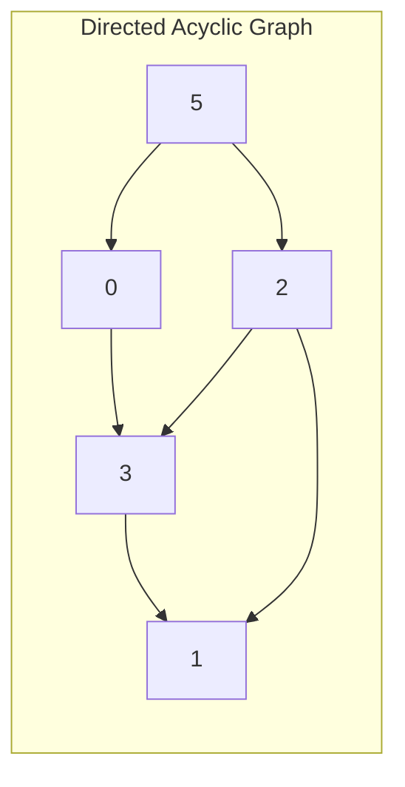

# TOPO Sort

*AI GENERATED START*

A Topological Sort or TOPO Sort is used to linearly order the vertices of a Directed Acyclic Graph (DAG) such that for every directed edge u → v, vertex u comes before v in the ordering.

Here's an example of a DAG:



A valid topological sort for this graph would be: 5 → 2 → 0 → 3 → 1

Note that there can be multiple valid topological orderings for the same graph. Another valid ordering would be: 5 → 0 → 2 → 3 → 1

*AI GENERATED END*

> A topological sort is a graph traversal in which each node v is visited only after all its dependencies are visited.  - *WikiPedia*

Topo Sort to implement it you require a modified dfs 

```python

adj_map = ... # dict with adjcency list

visited = set()

output = []

def dfs(node):
    if node in visited:
        #cycle detected
        return 
    for nei in adj_map[node]:
        dfs(nei)
    
    output.append(node)

for key in adj_map:
    dfs(node)

return outpt[::-1]

```

# Applications

Topological sort is used in linux kernel. There is a system call `tsort` which is basically does topological sort.

## tsort
*Need to explore the code for this*
This aommand was used in unix OS for file managment. 
There is a possibility that any file may be dependant on some other files' content. 
To make sure the files are loaded in correct order this command was called.

<blockquote> `tsort` exists because very early versions of the Unix linker processed an archive file exactly once, and in order.  As ‘ld’ read each object in the archive, it decided whether it was needed in the program based on whether it defined any symbols which were undefined at that point in the link.  

This whole procedure has been obsolete since about 1980, because Unix archives now contain a symbol table (traditionally built by ‘ranlib’, now generally built by ‘ar’ itself), and the Unix linker uses the symbol table to effectively make multiple passes over an archive file.
</blockquote>

--------------------------------------------------

Apart from this topological sort can be used in many places. I will still like their implementations and how its done.

Copied from [prepbytes](https://www.prepbytes.com/blog/graphs/topological-sort-algorithm/)

-------------------------------------------

1. Task Scheduling:
In project management and task scheduling, topological sort helps determine the optimal order of tasks with dependencies. Each node in the directed acyclic graph (DAG) represents a task, and directed edges represent dependencies between tasks. By performing a topological sort, you can schedule tasks in the correct sequence to ensure that dependent tasks are completed before their dependents.

2. Software Dependency Resolution:
When managing software projects with multiple modules or libraries, topological sort assists in resolving dependencies between software components. The algorithm ensures that dependencies are resolved in the correct order during compilation or deployment, preventing issues arising from missing dependencies.

3. Building Makefiles:
Makefiles in software development specify the sequence of commands required to build an application from its source code. Topological sort can be used to determine the correct order in which source files need to be compiled, taking into account their interdependencies.

4. Compiler Optimizations:
In compilers, topological sort aids in optimizing the order in which code is generated for different program segments. This optimization ensures that variables are allocated in the correct order and that loops are compiled with appropriate loop unrolling techniques.

5. Dependency Analysis:
In software engineering, topological sort is used to analyze dependencies between modules or components. This helps in understanding the relationships between different parts of a software system, enabling better maintenance and modification.

6. Deadlock Detection:
Topological sort can be used in resource allocation systems to detect deadlocks, which occur when processes are waiting for resources that are blocked by other processes. By creating a resource allocation graph and performing a topological sort, you can identify cycles that indicate potential deadlocks.

7. Course Scheduling:
In educational institutions, topological sort can help create efficient course schedules that ensure prerequisites are met. Each course is represented as a node, and prerequisites are represented by directed edges.

8. Event Management:
In event scheduling systems, topological sort assists in determining the optimal order of events or tasks to ensure that no event starts before its prerequisites are completed.

--------------------------------------------------
